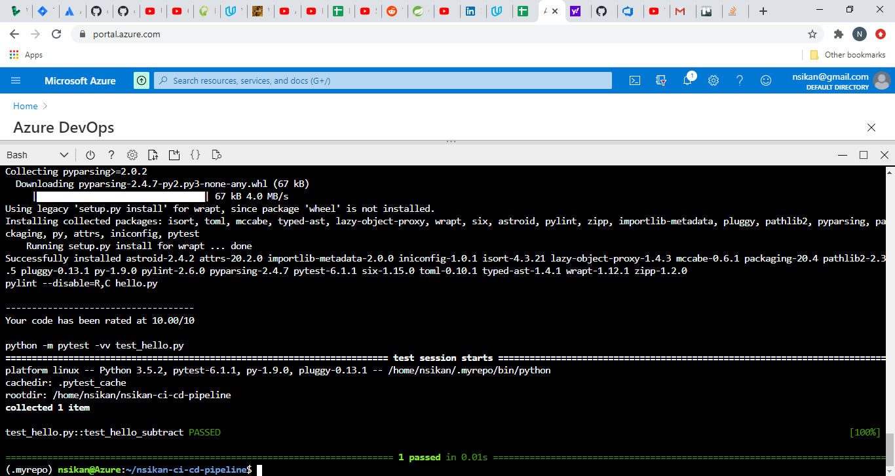
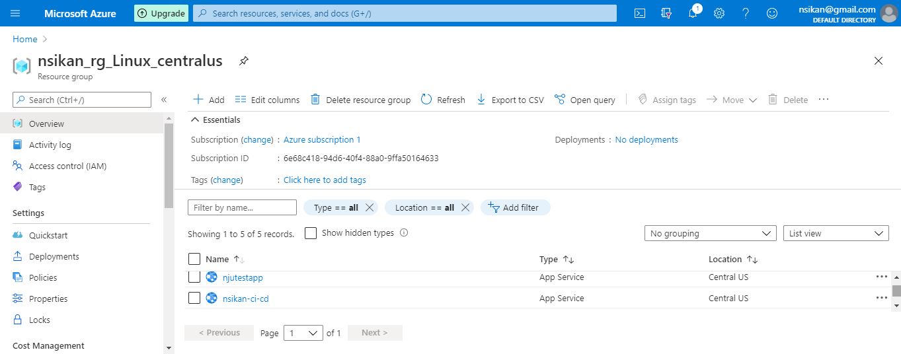
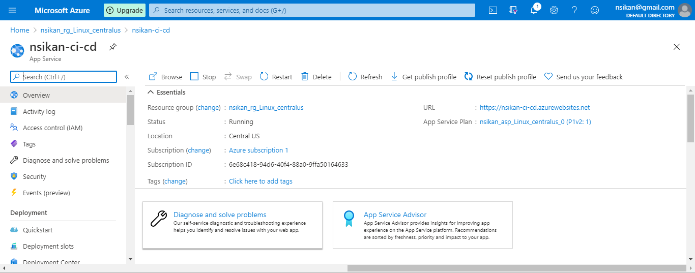
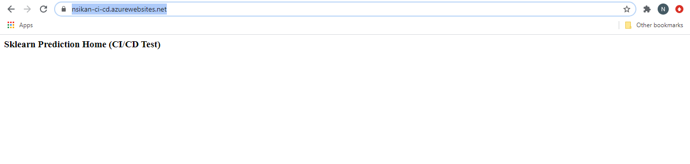

# Overview

This project demonstrates the setup and implementation of a CI/CD pipeline for a sample FLask Machine Learning application. After installation, a user should be able to see the continuous integration of updates to a repository with checks, and the deployment of the updates to a deployed website.

## Project Plan
Links to the Project Plans are listed below. The project plans show a very high-level description of work done, because this is a relatively simple project.
* [Trello board](https://trello.com/b/cMsRJ25q/build-ci-cd-pipeline)
* [Google Sheets](https://docs.google.com/spreadsheets/d/1zsZ4W2GNF-WPjgAXUryizli8ggC4jflC1hApE9sZ5U4/edit#gid=1348135932)

## Instructions
 
### Architecture
There are two aspects to this project, described below (images from Udacity):

- Continuous Integration

The architecture described below enables continuous integration of updated code into thte repository. When new code is checked into the repository, GitHub Actions builds the updated code and runs predefined checks (lint, etc.) before the updated code can be merged into the repository.


- Continuous Deployment

When the updated code has been merged into the repository, the change event from GitHub triggers Azure Pipelines to deploy the app with the updates.


<TODO:  Instructions for running the Python project.  How could a user with no context run this project without asking you for any help.  Include screenshots with explicit steps to create that work. Be sure to at least include the following screenshots:

### Running this project

In Azure Portal, launch Azure Cloud Shell. From the command prompt, clone this repository using the command:

`git clone git@github.com:Nsikan-Dev/nsikan-ci-cd-pipeline.git`

You should have SSH keys enabled in your GitHub account for this to work.

Next, create a virtual environment in your root directory,

`python3 -m venv ~/.nsikan-ci-cd`

activate the virtual environment,

`source ~/.nsikan-ci-cd/bin/activate`

then cd into the project directory

`cd nsikan-ci-cd-pipeline`

Note that we create the virtual environment outside of the project directory to prevent it from being mistakenly pushed to the repository. If you type the command `ls` at the prompt, you should get at least the following files:


Run `make install`. You should get the output below indicating that tests have been run and passed.



Create an app service and deploy your app. You can replace `nsikan-ci-cd` with a name of your choice when you run the command:

`az webapp up -n nsikan-ci-cd`

You can check for the deployed app in Azure Portal running on App Service.



Click on the app service, and it should take you to a page with more information about your deployed app



Verify that the application works at the deployed URL (in this example, https://nsikan-ci-cd.azurewebsites.net/)



Check the logs as well:


Make a prediction by running the command `./make_predict_azure_app.sh` in Azure Cloud Shell. If you deployed the app with a name other than nsikan-ci-cd, then update the line below in the file make_predict_azure_app.sh before running this command:

`-X POST https://<yourappname>.azurewebsites.net:$PORT/predict`

You should get the ouput below:

```
(.nsikan-ci-cd) nsikan@Azure:~/nsikan-ci-cd-pipeline$ ./make_predict_azure_app.sh
Port: 443
{"prediction":[20.35373177134412]}
```

### Setting up Azure Pipelines
As you follow the steps below, please double-check with [official documentation](https://docs.microsoft.com/en-us/azure/devops/pipelines/ecosystems/python-webapp?view=azure-devops). You will need to log into [Azure DevOps](https://dev.azure.com/) to complete these steps.

Step 1: Create a new project and name it
- Click on "Create New Project"
- In the dialog box that pops up, give your project a name and set its visibility to public
- Click Create

Step 2: Set up a new service connection
- Click on Project Settings -> Pipelines -> Service Connections -> New Service Connection
- In the dialog box that pops up, select Azure Resource Manager, then click Next
- In the next dialog box, under Scope, select Subscription, then Select your Subscription and Resource Group that contain the app service with your deployed app
- Name the service connection and select "Grant access permission to all pipelines", then click Save

Step 3: Create pipeline
- Select Pipeline -> Create Pipeline
- Select "GitHub YAML" to enable integration with GitHub
- Select "Python to Linux Web App on Azure" as your pipeline configuration
- Click "Validate and Configure"
- This should generate a yml file (azure-pipelines.yml), which you commit to your git repository.

Test:

* Successful deploy of the project in Azure Pipelines.  [Note the official documentation should be referred to and double checked as you setup CI/CD](https://docs.microsoft.com/en-us/azure/devops/pipelines/ecosystems/python-webapp?view=azure-devops).

* Running Azure App Service from Azure Pipelines automatic deployment

* Output of streamed log files from deployed application

> 

## Enhancements

To further improve this project, we might want to experiment with scheduled builds and deployments.

## Demo 


