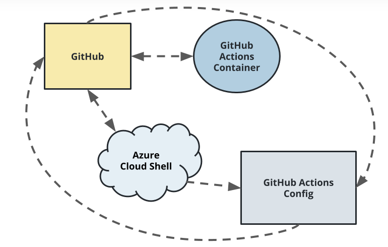
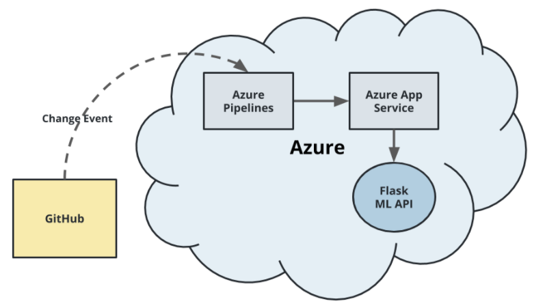
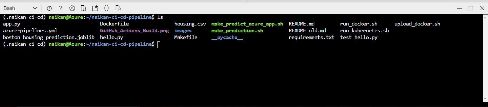

# Overview

This project demonstrates the setup and implementation of a CI/CD pipeline for a sample FLask Machine Learning application. After installation, a user should be able to see the continuous integration of updates to a repository with checks, and the deployment of the updates to a deployed website.

## Project Plan
Links to the Project Plans are listed below. The project plans show a very high-level description of work done, because this is a relatively simple project.
* [Trello board](https://trello.com/b/cMsRJ25q/build-ci-cd-pipeline)
* [Google Sheets](https://docs.google.com/spreadsheets/d/1zsZ4W2GNF-WPjgAXUryizli8ggC4jflC1hApE9sZ5U4/edit#gid=1348135932)

## Instructions
 
### Architecture
There are two aspects to this project, described below (images from Udacity):

- Continuous Integration

The architecture described below enables continuous integration of updated code into thte repository. When new code is checked into the repository, GitHub Actions builds the updated code and runs predefined checks (lint, etc.) before the updated code can be merged into the repository.



- Continuous Deployment

When the updated code has been merged into the repository, the change event from GitHub triggers Azure Pipelines to deploy the app with the updates.



<TODO:  Instructions for running the Python project.  How could a user with no context run this project without asking you for any help.  Include screenshots with explicit steps to create that work. Be sure to at least include the following screenshots:

### Running this project

In Azure Portal, launch Azure Cloud Shell. From the command prompt, clone this repository using the command:

`git clone git@github.com:Nsikan-Dev/nsikan-ci-cd-pipeline.git`

You should have SSH keys enabled in your GitHub account for this to work.

Next, create a virtual environment in your root directory,

`python3 -m venv ~/.nsikan-ci-cd`

activate the virtual environment,

`source ~/.nsikan-ci-cd/bin/activate`

then cd into the project directory

`cd nsikan-ci-cd-pipeline`

Note that we create the virtual environment outside of the projrct directory to prevent it from being mistakenly pushed to the repository. If you type the command `ls` at the prompt, you should get at least the following files:




* Project running on Azure App Service

* Project cloned into Azure Cloud Shell

* Passing tests that are displayed after running the `make all` command from the `Makefile`

* Output of a test run

* Successful deploy of the project in Azure Pipelines.  [Note the official documentation should be referred to and double checked as you setup CI/CD](https://docs.microsoft.com/en-us/azure/devops/pipelines/ecosystems/python-webapp?view=azure-devops).

* Running Azure App Service from Azure Pipelines automatic deployment

* Successful prediction from deployed flask app in Azure Cloud Shell.  [Use this file as a template for the deployed prediction](https://github.com/udacity/nd082-Azure-Cloud-DevOps-Starter-Code/blob/master/C2-AgileDevelopmentwithAzure/project/starter_files/flask-sklearn/make_predict_azure_app.sh).
The output should look similar to this:

```bash
udacity@Azure:~$ ./make_predict_azure_app.sh
Port: 443
{"prediction":[20.35373177134412]}
```

* Output of streamed log files from deployed application

> 

## Enhancements

<TODO: A short description of how to improve the project in the future>

## Demo 

<TODO: Add link Screencast on YouTube>


